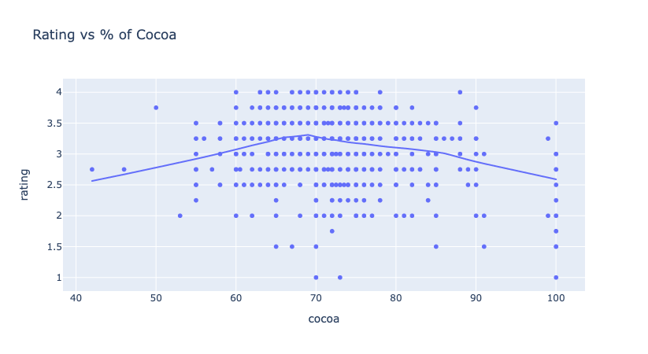
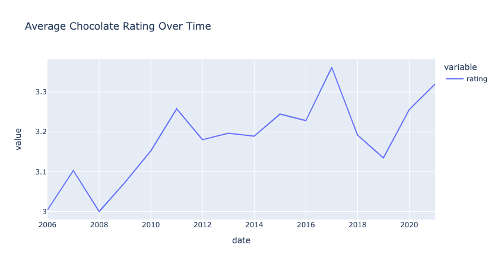

# Cho-Connoisseur
Quick study in the world of chocolate

# Summary
A demonstration of the volume of analysis that can be achieved in a single day's work. Cho-connoisseur starts with a raw data set found [here](http://flavorsofcacao.com/chocolate_database.html). Flavors of Cocoa is one Chocolate Connoisseur's log of chocolate bars sampled over 15 years and recorded for all to enjoy on the web. I set out to see if some of my favorite machine learning alogrithms could detect patterns in the data that might highlight certain indicators of quality based on the characteristics or origin of the chocolate.
 
 

# Problem Statement
Can the quality rating of chocolate bars be derived from the region of the beans, year produced, country of manufacturer, or number of ingredients of the raw chocolate?
 
 

# Data
## Source
[Flavors of Cocoa](http://flavorsofcacao.com/chocolate_database.html)

## Target
Chocolate Quality Rating (Ordinal/descrete) \
Scale 1-5

## Data Dictionary
|Feature|Type|Dataset|Description|
|-------|----|-------|-----------|
|company|string|chocolate.csv|Unique identifying number for manufacturer of the chocolate bar in string format.|
|country_company|string|chocolate.csv|Country where chocolate bar manufacturer resides.|
|date|int|chocolate.csv|Year chocolate bar was reviewed.|
|country_bean|string|chocolate.csv|Country of origin where the cocoa bean used to produce the chocolate was grown.|
|cocoa|float|chocolate.csv|Value Range: 0-100. Percentage of cocoa of the chocolate bar.|
|characteristics|string|chocolate.csv|List of flavor profiles as described by the Manhattan Chocolate Society.|
|rating|int|chocolate.csv|Range: 1-5. Outstanding: 4 - 5. Highly recommended: 3.5 - 3.9. Recommended: 3.0 - 3.49. Disappointing: 2.0 - 2.9. Unpleasant: 1.0 - 1.9|
|ing_num|int|chocolate.csv|Number of ingredients in the chocolate's recipe.|
|B|int|chocolate.csv|Binarized. Beans in recipe. 1 = yes, contains. 0 = no, does not contain.|
|C|int|chocolate.csv|Binarized. Beans in recipe. 1 = yes, contains. 0 = no, does not contain.|
|L|int|chocolate.csv|Binarized. Lecithin in recipe. 1 = yes, contains. 0 = no, does not contain. Lecithin is a mixture of fats and typically used for smoothing food textures.|
|S|int|chocolate.csv|Binarized. Sugar in recipe. 1 = yes, contains. 0 = no, does not contain.|
|S*|int|chocolate.csv|Binarized. Sweetener other than white cane or beet sugar in recipe. 1 = yes, contains. 0 = no, does not contain.|
|Sa|int|chocolate.csv|Binarized. Salt in recipe. 1 = yes, contains. 0 = no, does not contain.|
|V|int|chocolate.csv|Binarized. Vanilla in recipe. 1 = yes, contains. 0 = no, does not contain.|

 
 

# Models
Regression models optimized for root mean squared error. Testing set error scores are as follows:
|Model|RMSE|
|-----|--------|
|Baseline|0.451|
|Lasso Regression|0.362|
|Ridge Regression|0.369|
|Random Forest|0.420|
|Ada Boost|0.437|

 
 

# Findings
Good news & bad news. 

## Bad News: 
Will start with the bad news. Chocolate quality is fairly subjective. There appears to be a slight sweet spot around 70% cocoa for the highest average rating of chocolate, but ultimately, I either do not have enough data from a diverse group of chocolate judges (this dataset is one chocolate connoisseur's option over 15+ years)
 

 
 

## Good News:
Chocolate quality has improved over time! With the assumption that chocolate bars were randomly sampled over time, there is a steady uptick in quality as time goes on. Was able to find the smallest signal in the data. So, with more time, effort and diversity of algorithm, error scores can likely be reduced further.

 
 

# Next Steps

* Incorporating PCA for dimensionality reduction and potentially some unsupervised learning clusters. 

* Go deeper into chocolate characteristics. An analysis on the model coefficients could provide deeper insights into chocolate bar rating.

* A recommender tool could be built to provide recommendations to curious users based on their personal preferences in chocolate bars.

* Categorizing the data into ratings of Outstanding: 4 - 5, highly recommended: 3.5 - 3.9, recommended: 3.0 - 3.49, Disappointing: 2.0 - 2.9, Unpleasant: 1.0 - 1.9 could simplify the target variable and potentially lead to a reduction in error.

* Using a neural network to drastically increase the model complexity. We have a LOT of sparse data in our characteristics. Using a more complex model could yield nice results. 

* A support vector machine could also be an interesting option. Modeling the errors in a noisy data set can produce nice results.

* Go deeper into company specifics. Its plausible certain companies are better at making chocolate than others.

 
 

# Thank you!
I greatly appreciate you making it this far into my analysis. Time is the most valuable resource we possess. You spending some of your valuable time reviewing my work is incredibly generous.